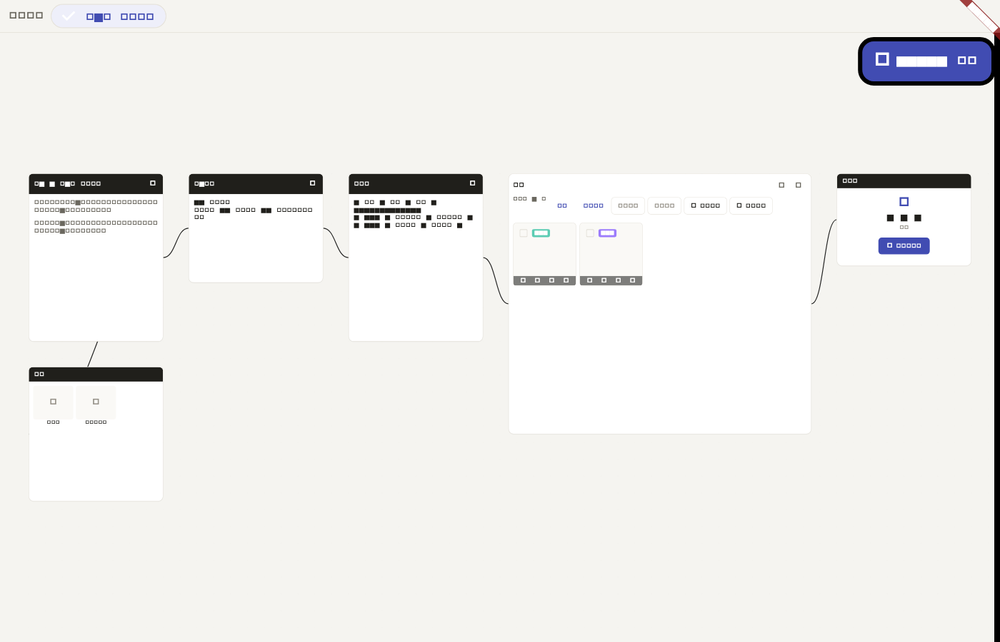
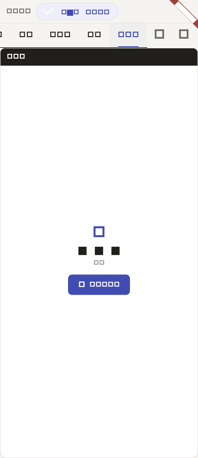

# 2026-07-05 Production Canvas Visual Parity Evidence

This is evidence tracking for the `制作画布` page. It does not claim full
ToonFlow product parity outside this page.

## Regenerate

Run from `app/`:

```bash
flutter test --update-goldens tool/capture_production_visual_evidence_test.dart
```

The capture script is:

```text
app/tool/capture_production_visual_evidence_test.dart
```

It seeds the local Dart engine with the offline short-drama data chain, renders
the Flutter production page at desktop and 390px mobile widths, and writes:

- `visual-evidence/production-canvas/desktop-canvas.png`
- `visual-evidence/production-canvas/mobile-tabs.png`

## Screenshots

These screenshots are generated by Flutter's test/golden renderer. The test
environment can substitute text glyphs with square placeholders, so the PNGs
are layout evidence rather than typography evidence. Node names, button labels,
and localized text are covered by widget/i18n tests listed below.

Desktop canvas:



Mobile tabs:



## Reference Anchors

ToonFlow source anchors:

- `Toonflow-web/src/views/production/index.vue`
- `Toonflow-web/src/views/production/utils/flowBuilder.ts`
- `Toonflow-web/src/views/production/node/script.vue`
- `Toonflow-web/src/views/production/node/scriptPlan.vue`
- `Toonflow-web/src/views/production/node/assets.vue`
- `Toonflow-web/src/views/production/node/storyboardTable.vue`
- `Toonflow-web/src/views/production/node/storyboard.vue`
- `Toonflow-web/src/views/production/node/workbench.vue`
- `Toonflow-web/src/views/production/components/rightChatBox/index.vue`

DramaFlow implementation anchors:

- `app/lib/src/screens/production/production_screen.dart`
- `app/lib/src/screens/production/script_plan_node.dart`
- `app/lib/src/screens/production/storyboard_canvas_node.dart`
- `app/lib/src/screens/production/canvas_chat_panel.dart`
- `app/lib/src/screens/production/workbench_screen.dart`
- `app/test/widgets/production_screen_test.dart`
- `app/test/widgets/script_plan_node_test.dart`
- `app/test/widgets/storyboard_canvas_node_test.dart`
- `app/test/widgets/canvas_chat_panel_test.dart`
- `app/test/widgets/df_widgets_test.dart`

## Node And Edge Checklist

| ToonFlow node | DramaFlow page evidence | Test evidence |
|---|---|---|
| `script` | Desktop canvas renders the script node; mobile first tab uses the same node body. | `production_screen_test.dart` covers desktop node render, script edit, Markdown tools, and persistence. |
| `scriptPlan` | Desktop canvas renders the planning node; mobile has a dedicated `剧本规划` tab. | `script_plan_node_test.dart` covers empty state, save, edit, and cancel behavior. |
| `assets` | Desktop canvas attaches the assets node below script; mobile has an assets tab and inspector entry. | `production_screen_test.dart` covers opening the node image editor from an asset card. |
| `storyboardTable` | Desktop canvas renders the storyboard-table node; mobile has a storyboard-table tab. | `production_screen_test.dart` covers Markdown save and preview persistence. |
| `storyboard` | Desktop canvas renders the storyboard grid; mobile has a storyboard tab. | `storyboard_canvas_node_test.dart` covers whole-gallery preview and storyboard insertion. |
| `workbench` | Desktop canvas renders the workbench card; mobile has a workbench tab and opens the same workbench flow. | `production_screen_test.dart` covers desktop and mobile workbench entry plus local compose. |

Edges carried from ToonFlow `flowBuilder.ts` into DramaFlow `DFCanvas`:

- script -> assets
- script -> scriptPlan
- scriptPlan -> storyboardTable
- storyboardTable -> storyboard
- storyboard -> workbench

## Interaction Checklist

| ToonFlow behavior | DramaFlow parity decision | Evidence |
|---|---|---|
| VueFlow canvas with fit-view, pan/zoom, visible nodes and edges | Flutter `DFCanvas` uses `InteractiveViewer`, fit-on-init, node stack, custom painted edges, and viewport culling. | `df_widgets_test.dart` covers 1000-node viewport culling. |
| Episode selector above canvas | Flutter renders horizontal episode chips above the canvas. | `production_screen_test.dart` asserts episode selection chip render. |
| Right-side `rightChatBox` | Desktop uses a right slide-out `CanvasChatPanel`; mobile opens fullscreen Agent chat. | `canvas_chat_panel_test.dart` and `production_screen_test.dart`. |
| Script and storyboard-table Markdown editing | Flutter uses Markdown preview plus editor dialogs, saving into the embedded engine. | `production_screen_test.dart`. |
| Storyboard grid with image generation/preview/edit flow | Flutter keeps the storyboard grid and routes image editing to `ImageFlowEditor`. | `storyboard_canvas_node_test.dart` and `image_flow_editor_test.dart`. |
| Workbench card opens the video workbench | Flutter opens the local workbench and can compose the seeded episode without Node/server. | `production_screen_test.dart` and `tool/e2e_local_smoke.dart`. |
| Mobile adaptation | ToonFlow production is desktop VueFlow-first; DramaFlow uses six mobile tabs plus node inspector and fullscreen chat/workbench dialogs. | `production_screen_test.dart` 390px cases and `mobile-tabs.png`. |

## Remaining Scope Notes

This evidence closes the missing source-anchored production-page visual evidence
loop against the local ToonFlow source anchors and current DramaFlow screenshots.
It does not close the separate `多轨工作台` full WebAV/NLE gap or the
`Agent 体系页` multi-layer Agent/RAG gap. If the acceptance bar requires a live
running ToonFlow browser screenshot, that remains a separate environment task.
